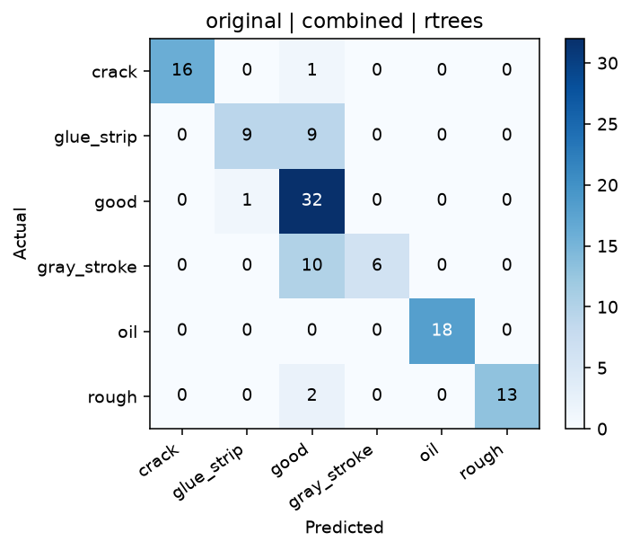

# OpenCV Preprocessing Advisor

이미지의 상태를 수치로 진단하고, 목적에 맞는 OpenCV 전처리 파이프라인 3개를 근거와 함께 추천하며, 실제 분류 데이터셋에서는 교차검증으로 효과를 검증하는 포트폴리오 프로젝트입니다.

> 핵심 원칙: 보기 좋아진 이미지를 좋은 전처리라고 단정하지 않습니다. 단일 이미지는 설명 가능한 휴리스틱으로 탐색하고, 실제 효과는 데이터셋 평가로 검증합니다.

## 무엇을 보여주는 프로젝트인가

- 밝기, 클리핑, 전역·국소 대비, entropy, 선명도, 노이즈, 조명 균일성, edge, 색상 특성을 OpenCV로 측정합니다.
- 정규화, gamma, CLAHE, Gaussian·median·bilateral filter, unsharp mask, morphology를 단일 단계가 아닌 재현 가능한 파이프라인으로 구성합니다.
- HOG, HSV/LAB histogram, Sobel·Laplacian·Gabor 통계를 특징으로 사용합니다.
- `cv2.ml`의 SVM, kNN, RTrees를 동일한 stratified cross-validation 조건에서 비교합니다.
- 추천 이유, 경고, 점수 구성요소, 중간 이미지, 클래스별 지표, 시간, 혼동행렬을 저장합니다.
- 설정 파일 hash, OpenCV 버전, seed를 보고서에 남겨 재현성을 확보합니다.

## 두 가지 실행 모드

### 1. 단일 이미지 Advisor

GT와 라벨이 없는 새 이미지 한 장에도 사용할 수 있습니다.

1. 이미지 상태 진단
2. 목적 프로필(`auto`, `shape`, `color`, `texture`) 선택
3. 후보 파이프라인 실제 적용
4. 전후 지표 변화로 적합도 계산
5. 상위 3개 파이프라인, 단계별 이미지, 이유와 위험 요소 출력

이 점수는 정확도나 성공 확률이 아니라 **탐색 우선순위를 정하는 휴리스틱**입니다.

### 2. Dataset Benchmark

`root/class_name/image.png` 구조의 데이터셋에서 전처리 효과를 직접 비교합니다.

1. 클래스별 이미지를 결정적인 순서로 탐색
2. stratified K-fold 분할
3. OpenCV 전처리 적용
4. OpenCV 특징 추출
5. 학습 fold에서만 표준화한 뒤 `cv2.ml` 분류기 학습
6. Macro F1, accuracy, 클래스별 precision/recall/F1, 처리 시간, 혼동행렬 출력

## MVTec tile 사례 연구

첫 검증 데이터는 로컬의 MVTec AD `tile/test` 폴더입니다. 이상치 GT를 사용하지 않고 `crack`, `glue_strip`, `good`, `gray_stroke`, `oil`, `rough`를 6개 분류 클래스로 해석했습니다.

- 이미지: 117장
- 평가: stratified 5-fold, seed 42
- 특징: HOG + HSV/LAB histogram + Sobel/Laplacian/Gabor 통계
- 분류기: SVM, kNN, RTrees

| 순위 | 전처리 | 분류기 | Accuracy | Macro F1 |
|---:|---|---|---:|---:|
| 1 | Original | RTrees | 0.804 | **0.789** |
| 2 | CLAHE + Bilateral | RTrees | 0.766 | 0.731 |
| 3 | LAB CLAHE | RTrees | 0.664 | 0.594 |

결과는 전처리를 더 많이 적용한다고 성능이 자동으로 좋아지지 않는다는 점을 보여줍니다. 이 데이터와 특징 조합에서는 원본이 가장 강했고, 강한 국소 대비 향상은 타일 질감의 클래스 구분 정보를 왜곡했을 가능성이 있습니다. 이는 원인에 대한 가설이며 다른 데이터셋으로 일반화할 수 없습니다.



## 빠른 시작

Python 3.11 이상을 권장합니다.

```powershell
git clone <repository-url>
cd opencv-preprocessing-advisor
python -m venv .venv
.\.venv\Scripts\Activate.ps1
python -m pip install -e .
streamlit run app.py
```

전체 흐름을 합성 데이터로 확인하려면:

```powershell
python -m opencv_preprocessing_advisor.cli self-check --output outputs/self-check
```

이미지 한 장 분석:

```powershell
opencv-prep analyze-image --image data/samples/example.png --profile auto
```

클래스 폴더 벤치마크:

```powershell
opencv-prep benchmark `
  --dataset "C:\path\to\class-folder-dataset" `
  --folds 5 `
  --pipelines original,lab-clahe,clahe-bilateral `
  --features combined `
  --classifiers svm,knn,rtrees
```

## 산출물

각 실행은 덮어쓰기 방지를 위해 고유 폴더에 저장됩니다.

```text
outputs/
├─ image_advisor/<run-id>/
│  ├─ comparison.png
│  ├─ diagnostics.csv
│  ├─ recommendations.json
│  └─ steps/<pipeline-id>/*.png
└─ benchmark/<run-id>/
   ├─ leaderboard.csv
   ├─ fold_metrics.csv
   ├─ class_metrics.csv
   ├─ timings.csv
   ├─ run_config.json
   └─ confusion_matrices/*.png
```

## 프로젝트 구조

```text
config/       파이프라인 및 점수 설정
src/          진단, 변환, 특징, 평가, 서비스, 보고서, CLI
ui/           Streamlit 다중 페이지 화면
tests/        단위·통합·UI 실행 회귀 테스트
docs/         설계, 구현 계획, 결과 이미지
```

## 검증

```powershell
pytest -q
ruff check .
ruff format --check .
python -m opencv_preprocessing_advisor.cli self-check
```

현재 구현은 딥러닝, 외부 비전 API, 이상치 GT 평가를 사용하지 않습니다. 단일 이미지 추천과 데이터셋 성능 검증의 역할을 분리한 것이 설계의 핵심입니다. 알려진 환경 문제는 [TROUBLESHOOTING.md](TROUBLESHOOTING.md)를 참고하세요.

