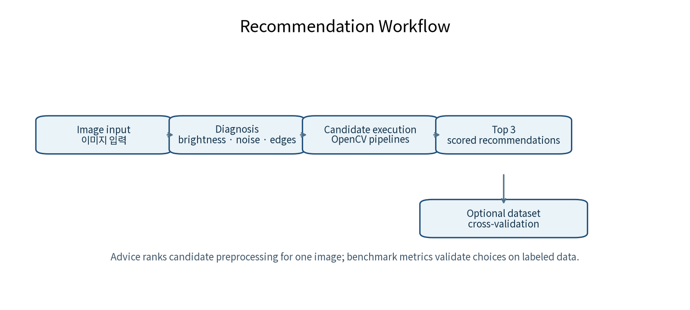
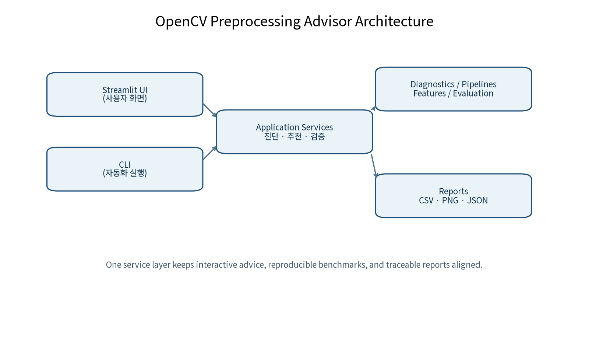
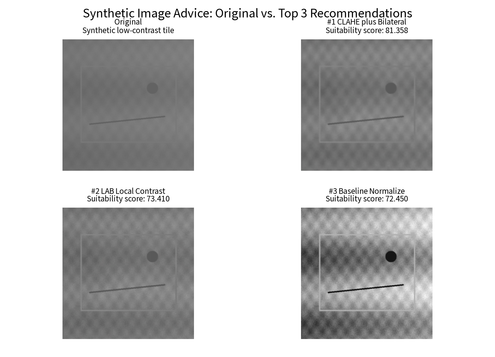

# OpenCV Preprocessing Advisor

[English](README_EN.md) · [사례 연구](docs/portfolio/case-study.md) · [실험 결과](docs/portfolio/experiment-results.md) · [한계](docs/portfolio/limitations.md)

이미지를 보기 좋게 만드는 전처리와, 다운스트림 분류에 실제로 도움이 되는 전처리는 다를 수 있습니다. 이 프로젝트는 단일 이미지를 수치로 진단해 **설명 가능한 Top 3 후보**를 제안하고, 레이블이 있는 데이터셋에서는 같은 후보를 **교차 검증**으로 검증합니다.

> 단일 이미지의 추천은 탐색 우선순위입니다. **휴리스틱 점수는 정확도가 아닙니다**. 성능 결론은 데이터셋 평가에서만 냅니다.

## 한눈에 보는 결과

| 검증 범위 | 관찰된 결과 | 근거 |
| --- | --- | --- |
| MVTec tile 상태 폴더 분류 사례 | 117 images, 6개 클래스, stratified 5-fold, seed 42 | [평가 프로토콜](docs/portfolio/experiment-results.md#정확한-평가-프로토콜) |
| 최고 조합 | Original + RTrees — Accuracy **0.804**, Macro F1 **0.789** | [리더보드](docs/portfolio/experiment-results.md#리더보드) |
| 단일 이미지 사용성 | 진단 변화·이유·경고를 포함한 Top 3 후보 | [추천 설계](docs/portfolio/case-study.md#단일-이미지-추천) |

- 이미지: 117장

## 문제를 두 개로 나눈 이유

새 이미지 한 장에는 레이블이 없으므로, Advisor는 밝기·대비·노이즈·에지·색상·클리핑 같은 [진단값](src/opencv_preprocessing_advisor/diagnostics.py) 변화로 후보를 비교합니다. 반대로 Dataset Benchmark는 같은 전처리 후 [고전 특징](src/opencv_preprocessing_advisor/features.py)과 [OpenCV 분류기](src/opencv_preprocessing_advisor/classifiers.py)를 비교해 Macro F1과 accuracy를 측정합니다. 이 분리는 “시각적으로 강한 효과”를 “분류 성능 향상”으로 오해하지 않기 위한 설계입니다.



## OpenCV 근거: 구현과 테스트까지 연결

| 영역 | 적용한 OpenCV 기법 | 구현 · 회귀 테스트 |
| --- | --- | --- |
| 이미지 진단 | 밝기, 대비, entropy, 선명도, 노이즈, 에지, 색상, clipping | [코드](src/opencv_preprocessing_advisor/diagnostics.py) · [테스트](tests/test_diagnostics.py) |
| 전처리 후보 | normalize, gamma, CLAHE, Gaussian/median/bilateral, morphology | [코드](src/opencv_preprocessing_advisor/transforms.py) · [테스트](tests/test_transforms.py) |
| 특징 | HOG, HSV/LAB histogram, Sobel/Laplacian/Gabor 통계 | [코드](src/opencv_preprocessing_advisor/features.py) · [테스트](tests/test_features.py) |
| 공정한 비교 | stratified K-fold, fold-local scaling, Macro F1 | [코드](src/opencv_preprocessing_advisor/evaluation.py) · [테스트](tests/test_evaluation.py) |
| 재현 가능한 보고 | CSV, JSON, PNG, config hash, OpenCV version, seed | [코드](src/opencv_preprocessing_advisor/reports.py) · [테스트](tests/test_reports.py) |

전체 기법과 선택 이유는 [OpenCV 증거 맵](docs/portfolio/evidence-map.md)에서 확인할 수 있습니다.

## 구조: UI가 아닌 서비스와 증거가 중심

Streamlit/CLI는 같은 서비스 계층을 호출합니다. 진단과 후보 실행, 특징·평가, 보고서를 분리해 UI 밖에서도 테스트와 재생성이 가능하도록 구성했습니다.



## 추천은 결과와 위험을 함께 보여준다

아래 이미지는 프로젝트 코드가 생성한 합성 저대비 타일 예시입니다. 후보별 점수만 제시하지 않고, 진단 변화와 과도한 평활화·에지·색 손실 같은 경고를 함께 남깁니다. LAB L-channel CLAHE는 밝기 채널만 조정해 색상 관계를 덜 교란하려는 선택이며, 어느 필터도 항상 우수하다고 가정하지 않습니다. [설계 판단 자세히 보기](docs/portfolio/case-study.md#단일-이미지-추천)



## 데이터셋 검증: 원본이 이긴 것도 결과다

MVTec AD `tile/test`의 상태 폴더에서 `crack`, `glue_strip`, `good`, `gray_stroke`, `oil`, `rough`를 6개 분류 클래스로 해석한 제한된 분류 사례입니다. GT mask나 anomaly localization은 사용하지 않았으며, 아래 수치는 공식 MVTec anomaly-detection metric이 아닙니다.

| 순위 | Pipeline | Classifier | Accuracy | Macro F1 |
| ---: | --- | --- | ---: | ---: |
| 1 | Original | RTrees | 0.804 | **0.789** |
| 2 | CLAHE + Bilateral | RTrees | 0.766 | 0.731 |
| 3 | LAB CLAHE | RTrees | 0.664 | 0.594 |

원본 + RTrees가 세 후보 중 최고였습니다. 이 관찰은 이 데이터·고정 특징·선택한 분할에서 대비 강화나 평활화가 항상 더 좋은 표현을 만들지 않는다는 뜻입니다. 원인에 대한 해석은 가설이며 다른 데이터셋에 일반화하지 않습니다. [실험 설정·혼동행렬 읽기·해석](docs/portfolio/experiment-results.md)을 함께 보세요.


## 재현성과 테스트

- 동일한 fold 계획에서 SVM, kNN, RTrees를 비교하고, 표준화기는 훈련 fold에만 적합해 누수를 막습니다. [평가 코드](src/opencv_preprocessing_advisor/evaluation.py) · [테스트](tests/test_evaluation.py)
- benchmark의 수치와 생성 근거는 경로를 포함하지 않는 [재생성 증거 요약](docs/portfolio/benchmark-evidence.json)에 남깁니다.
- 단위·통합·UI 회귀 테스트는 [`tests/`](tests)에서, 포트폴리오 주장 계약은 [`tests/test_portfolio_content.py`](tests/test_portfolio_content.py)에서 확인합니다.

```powershell
pytest -q
ruff check .
ruff format --check .
python -m opencv_preprocessing_advisor.cli self-check
```

## 빠른 시작

Python 3.11 이상을 권장합니다.

```powershell
git clone https://github.com/dansojo/opencv-preprocessing-advisor.git
cd opencv-preprocessing-advisor
python -m venv .venv
.\.venv\Scripts\Activate.ps1
python -m pip install -e .
streamlit run app.py
```

합성 데이터로 전체 경로를 확인하거나, 이미지·클래스 폴더를 직접 실행할 수 있습니다.

```powershell
python -m opencv_preprocessing_advisor.cli self-check --output outputs/self-check
opencv-prep analyze-image --image data/samples/example.png --profile auto
opencv-prep benchmark --dataset "C:\path\to\class-folder-dataset" --folds 5 --pipelines original,lab-clahe,clahe-bilateral --features combined --classifiers svm,knn,rtrees
```

## 적용 범위와 한계

이 프로젝트는 모든 OpenCV API, 딥러닝, 또는 공식 MVTec anomaly-detection 평가를 주장하지 않습니다. 117장·6클래스 사례는 데이터셋 특이적이며, SIFT는 구현돼 있지만 현재 BenchmarkService feature profile에는 노출되지 않습니다. 운영 적용 전에는 목표 데이터·오류 비용·시각 요구에 맞춰 별도 검증이 필요합니다. [전체 한계와 다음 실험](docs/portfolio/limitations.md)

## 포트폴리오 자료

- [6페이지 PDF 포트폴리오](output/pdf/opencv-preprocessing-advisor-portfolio.pdf) — 안정된 빌드 산출물 경로입니다. PDF는 포트폴리오 빌드 단계에서 생성됩니다.
- [정본 사례 연구](docs/portfolio/case-study.md) · [실험 결과](docs/portfolio/experiment-results.md) · [증거 맵](docs/portfolio/evidence-map.md)

### Notion 케이스 스터디

- [상세 Notion 케이스 스터디](https://app.notion.com/p/3aed0dc3cc1d81c0977fd982867f94e1) — 프로젝트 배경, 설계 판단, MVTec 실험, 실패 해석, 한계와 다음 실험을 12개 섹션으로 정리한 검증된 원본입니다. 현재 페이지는 비공개이며, 소유자의 명시적 공개 승인과 익명 접근 확인 전에는 공개 접근이 가능한 링크로 취급하지 않습니다.

비공개 Notion 원본은 위 저장소 정본과 동일한 지표·한계를 사용하며, 구현 근거는 GitHub `main` 소스 링크로 추적할 수 있습니다.
