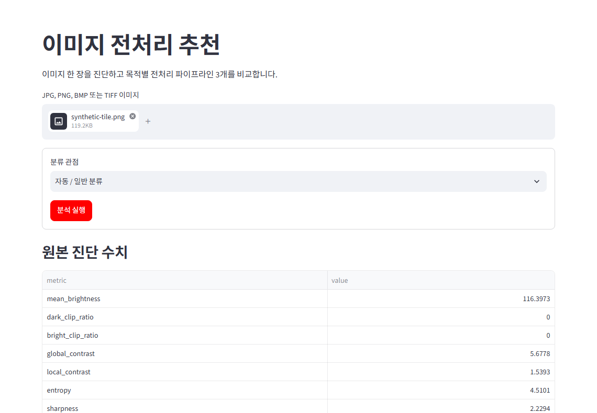

# OpenCV Preprocessing Advisor

[한국어](README.md) · [Case study](docs/portfolio/case-study.md) · [Experiment results](docs/portfolio/experiment-results.md) · [Limitations](docs/portfolio/limitations.md)

An evidence-driven OpenCV portfolio: diagnose a single image, recommend three explainable preprocessing candidates, then measure downstream impact on labeled data with cross-validation.

> The single-image score is a transparent heuristic, not an accuracy estimate. Classification conclusions come only from the dataset evaluation.

## Snapshot

| Scope | Observed result | Evidence |
| --- | --- | --- |
| MVTec tile status-folder classification case | 117 images, six classes, stratified 5-fold, seed 42 | [Protocol](docs/portfolio/experiment-results.md#정확한-평가-프로토콜) |
| Best combination | Original + RTrees — Accuracy **0.804**, Macro F1 **0.789** | [Leaderboard](docs/portfolio/experiment-results.md#리더보드) |
| Single-image output | Explainable Top 3 candidates with diagnostic changes and warnings | [Recommendation design](docs/portfolio/case-study.md#단일-이미지-추천) |

## Why separate recommendation from evaluation?

The Advisor ranks candidates from measurable brightness, contrast, noise, edge, color, and clipping changes in [diagnostics](src/opencv_preprocessing_advisor/diagnostics.py). The Benchmark measures the same preprocessing with [classical features](src/opencv_preprocessing_advisor/features.py) and [OpenCV classifiers](src/opencv_preprocessing_advisor/classifiers.py). This avoids treating a stronger-looking image as evidence of better classification.


## OpenCV evidence

| Area | Technique | Implementation · regression test |
| --- | --- | --- |
| Diagnosis | brightness, contrast, entropy, sharpness, noise, edges, color, clipping | [code](src/opencv_preprocessing_advisor/diagnostics.py) · [test](tests/test_diagnostics.py) |
| Candidates | normalization, gamma, CLAHE, Gaussian/median/bilateral, morphology | [code](src/opencv_preprocessing_advisor/transforms.py) · [test](tests/test_transforms.py) |
| Features | HOG, HSV/LAB histograms, Sobel/Laplacian/Gabor statistics | [code](src/opencv_preprocessing_advisor/features.py) · [test](tests/test_features.py) |
| Evaluation | stratified K-fold, fold-local scaling, Macro F1 | [code](src/opencv_preprocessing_advisor/evaluation.py) · [test](tests/test_evaluation.py) |
| Reports | CSV, JSON, PNG, config hash, OpenCV version, seed | [code](src/opencv_preprocessing_advisor/reports.py) · [test](tests/test_reports.py) |

The full implementation-to-test map is in the [OpenCV evidence map](docs/portfolio/evidence-map.md).

## Architecture and recommendation example

The Streamlit UI and CLI call the same services; diagnostics, candidate execution, feature/evaluation, and reporting remain testable outside the UI.


The project-generated synthetic example compares candidates with their score labels and warnings. LAB L-channel CLAHE changes luminance while preserving the LAB color channels; no filter is assumed to be universally best. [Design detail](docs/portfolio/case-study.md#단일-이미지-추천)


This is a real Streamlit capture from analyzing that same synthetic tile. It contains no private, customer, or MVTec source image.



## Dataset result: the baseline won

This is a limited classification case that interprets MVTec AD `tile/test` status folders as six classes. It does not use GT masks or anomaly localization, and is not an official MVTec anomaly-detection metric.

| Rank | Pipeline | Classifier | Accuracy | Macro F1 |
| ---: | --- | --- | ---: | ---: |
| 1 | Original | RTrees | 0.804 | **0.789** |
| 2 | CLAHE + Bilateral | RTrees | 0.766 | 0.731 |
| 3 | LAB CLAHE | RTrees | 0.664 | 0.594 |

Original + RTrees was best among these three candidates. For this dataset, fixed feature profile, and split, stronger contrast or smoothing did not automatically create a better representation; causal explanations remain hypotheses. See the [protocol, confusion-matrix reading, and interpretation](docs/portfolio/experiment-results.md).


## Reproducibility and tests

- SVM, kNN, and RTrees use the same fold plan; scaling is fit on training folds only. [evaluation code](src/opencv_preprocessing_advisor/evaluation.py) · [test](tests/test_evaluation.py)
- Path-free benchmark provenance is recorded in [benchmark evidence](docs/portfolio/benchmark-evidence.json).
- Unit, integration, UI, and portfolio-claim contracts live in [`tests/`](tests) and [`tests/test_portfolio_content.py`](tests/test_portfolio_content.py).

```powershell
pytest -q
ruff check .
ruff format --check .
python -m opencv_preprocessing_advisor.cli self-check
```

## Quick start

Python 3.11+ is recommended.

```powershell
git clone https://github.com/dansojo/opencv-preprocessing-advisor.git
cd opencv-preprocessing-advisor
python -m venv .venv
.\.venv\Scripts\Activate.ps1
python -m pip install -e .
python -m pip install -r requirements-dev.txt
python scripts/build_portfolio_assets.py --output docs/portfolio/assets --sample data/samples/synthetic-tile.png
python scripts/build_portfolio_pdf.py --assets docs/portfolio/assets --output output/pdf/opencv-preprocessing-advisor-portfolio.pdf
streamlit run app.py
```

The portfolio image and PDF builders always use the committed `docs/portfolio/fonts/NotoSansKR-Regular.ttf` font, distributed with its [SIL Open Font License](docs/portfolio/fonts/OFL.txt). No Korean system font is required on the build machine; keep the font and license together.

```powershell
python -m opencv_preprocessing_advisor.cli self-check --output outputs/self-check
opencv-prep analyze-image --image data/samples/synthetic-tile.png --profile auto
opencv-prep benchmark --dataset "C:\path\to\class-folder-dataset" --folds 5 --pipelines original,lab-clahe,clahe-bilateral --features combined --classifiers svm,knn,rtrees
```

## Limits and portfolio materials

The project does not claim every OpenCV API, deep learning, or official MVTec anomaly-detection performance. The 117-image/six-class result is dataset-specific, and SIFT is implemented but not exposed as a BenchmarkService feature profile. Read the [full limitations and next experiments](docs/portfolio/limitations.md).

- [Six-page PDF portfolio](output/pdf/opencv-preprocessing-advisor-portfolio.pdf) — stable build-artifact path; generated by the portfolio PDF build step.
- [Canonical case study](docs/portfolio/case-study.md) · [experiment results](docs/portfolio/experiment-results.md) · [evidence map](docs/portfolio/evidence-map.md)

### Notion case study

- [Detailed Notion case study](https://app.notion.com/p/3aed0dc3cc1d81c0977fd982867f94e1) — a verified 12-section source covering the project background, design decisions, MVTec experiment, failure interpretation, limitations, and next experiments. The page is currently private; do not treat the link as publicly accessible until the owner explicitly approves sharing and anonymous access is verified.
- [10-day OpenCV deep-learning course](https://app.notion.com/p/3aed0dc3cc1d816da128f233f7bec8de) — a private learning hub that connects image representation, diagnostics, preprocessing, features, `cv2.ml`, cross-validation, and project explanation through Days 1–10 plus separate Q&A, interview, and exercise references.

The private Notion source uses the same metrics and limitations as the repository sources above, with implementation evidence traced to GitHub `main`.
